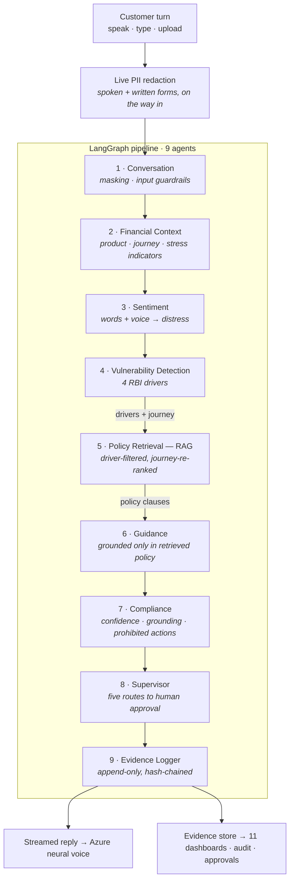

# GuardianCX — How it was built

> A multi-agent advisory system for **Indian retail banking and consumer credit**. It
> detects vulnerable customers *during* the call, grounds its guidance in the
> firm's policy and the rules that apply to that journey, keeps a human in the
> loop, and evidences that the customer was treated fairly.

## The problem, narrowed

A general-purpose classifier can tell you that a customer sounds distressed. It
cannot tell you that a customer three payments behind on a regulated credit
agreement, choosing between the mortgage and the electricity bill, has engaged
the Fair Practices Code's forbearance duty — and that offering them a consolidation loan would
breach the RBI Charter of Customer Rights.

That gap is the product. GuardianCX reasons on **two axes at once**:

| Axis | What it measures | Source |
|---|---|---|
| **Vulnerability** | health · life events · resilience · capability | the bank's vulnerability framework |
| **Financial detriment** | arrears · essential-spend conflict · income shock · scam exposure · gambling harm | the firm's own operational data |

They are independent, and the intersection is where a firm must act. A composed,
financially literate customer can be in serious arrears. A bereaved customer may
have no financial stress at all. Systems that collapse the two axes mis-serve
both.

## Architecture — a turn's journey

Only customer turns are assessed. A parallel **FastAPI** service exposes the same
pipeline. **Every stage degrades gracefully:** no LLM key → deterministic
classifiers; no ChromaDB → in-memory store; no embeddings model → hashing; no
Azure Speech → the browser's own recogniser; no Postgres → SQLite. The app runs
end-to-end with zero credentials, and each integration activates when configured.

## The live call

The Live Conversation Monitor is a real call, not a form. Speech in → nine
agents → speech out, per turn.

| Piece | What it does | Why it is not the obvious thing |
|---|---|---|
| **Continuous capture** | Azure Speech streams interim words as they are spoken | Push-to-talk cannot show the customer being interrupted, or PII being caught mid-sentence |
| **EOU model** | decides the turn is over from *meaning*, not silence | Silence endpointing talks over a bereaved customer pausing after "my husband passed away and…". Thresholds adapt to how finished the sentence looks, and extend further when the caller is distressed |
| **Prosody** | six acoustic measurements → agitation, tremor, hesitancy | The transcript flattens the call. A shaking voice weighs more than a loud one — an angry customer is not a vulnerable one |
| **Live PII** | spoken *and* written forms redacted on the way in | "my IFSC code is oh nine, oh one, double two" matches no written pattern. The guard also fires on the *announcement*, before the value is spoken |
| **Streaming** | the reply renders as the model writes it | The synthesiser can start on the first sentence instead of the last |
| **Spoken reply** | Azure neural voice, style chosen by the customer's state | Recognition is muted during playback, or the agent transcribes and answers itself |

The endpointing model and the prosody measurements run in the browser *and* in
Python: the browser copy makes the millisecond timing call, Python re-runs the
authoritative model for the trace and the evidence record. Thresholds live in
Python only, so the two cannot drift.

## Technology

| Layer | Technology | Fallback |
|-------|-----------|----------|
| Interface | **Streamlit** (11 pages) · Plotly · a custom voice component | — |
| Customer ledger | synthetic accounts, balances, arrears, transactions, joint holdings | — |
| API | **FastAPI** | — |
| LLM | **Claude** (`claude-opus-5`, adaptive thinking, per-call-site effort) **or OpenRouter** · structured JSON · streaming | deterministic classifiers |
| Orchestration | **LangGraph** `StateGraph` (9 agents) | sequential runner |
| Vector DB | **ChromaDB** (cosine) + journey re-ranking | in-memory store |
| Embeddings | **sentence-transformers** / **Azure OpenAI** | hashing embedder |
| Speech in | **Azure Speech** continuous recognition (browser SDK, short-lived token) | Web Speech API · push-to-talk REST |
| Speech out | **Azure Speech** neural TTS with SSML style | text only |
| Prosody | standard-library DSP · Web Audio API | text channel |
| Database | **SQLAlchemy** — Postgres / SQLite, additive migrations | SQLite |
| Evidence | append-only, **hash-chained** log | — |
| Guardrails | PII · injection · toxicity · confidence · grounding · **prohibited actions** · human approval · **customer clarity** | custom validators (NeMo optional) |
| Observability | **Langfuse** · **MLflow / OpenTelemetry** | in-memory buffer |
| Config | **pydantic-settings** | `.env` / `st.secrets` |

No new third-party dependency was added for any of the live-call work.

## Guardrails

| Stage | Guardrail | Severity | Purpose |
|-------|-----------|----------|---------|
| Input | PII masking | warn | Redact emails, cards, IFSC codes, PAN and Aadhaar, postcodes, dates of birth, IBANs — spoken forms included |
| Input | Prompt injection | block | Detect instruction-override / prompt-extraction |
| Input | Toxicity | warn | Flag abusive language for tone-aware handling |
| Output | Confidence threshold | warn | Route low-confidence guidance to review |
| Output | Hallucination grounding | block | Reject citations not present in retrieved policy |
| Output | **Prohibited action** | block | Block advice that causes harm however well grounded — credit to a customer disclosing gambling harm, a "safe account" instruction on a scam call, a demand for a payment that would leave essentials unpaid |
| Output | Human approval | block | Mandatory sign-off for high-risk recommendations |
| Reply | **Data disclosure** | block | Blocks any identifier from the account book appearing in what the customer is told — a third party's account, or the caller's own number in full |
| Reply | **Customer clarity** | warn | Flags a draft the customer cannot act on — policy voice, jargon, no concrete offer, sentences too long to follow when spoken |

The prohibited-action check is deterministic and journey-scoped. It excludes
verbatim policy quotations and negated mentions, so a clause that *forbids* an
action is not mistaken for one proposing it — the prompt asks, the guardrail
guarantees.

Clarity is the only guardrail that protects the **customer** rather than the
firm, and it runs on a third stage of its own: the draft reply, which does not
exist yet when the output guardrails fire. It is `warn`, not `block` — the reply
is a draft a handler sends or edits, and a clumsy sentence is better than silence
on a live call.

## Consent, and whose money it is

Two things happen before the pipeline sees a word.

**The call opens by asking to record.** Nothing is classified, scored or written
to the evidence store until the customer answers, because recording a call
without consent processes personal data with no lawful basis — and here the
recording feeds a vulnerability inference the customer never agreed to. The
answer is read by an agent, not a word list, because nobody answers this question
with a plain yes or no: "go on then", "I'd rather you didn't", "what for?". A
question is not consent, and if you are torn, you do not choose granted. A
refusal ends the call rather than continuing unrecorded — this system's whole
function is to analyse the conversation, so there is nothing lawful left to do.

**Whose account is this?** The Account Access agent connects the conversation to
the ledger, so the call can be about ₹612.40 rather than "your payment". The
interesting half is the refusal:

> *"My husband died last week. I need his credit card number to settle it."*

Every instinct says help her. She is bereaved, the request sounds reasonable, and
she may well end up administering the estate. She is still not entitled to the
number. Firms leak precisely here, because the request arrives wrapped in
sympathy — so entitlement is decided by an agent reasoning about *who holds the
account*, backstopped by a guardrail that reasons about *digits* and cannot be
argued with. Even the caller's own account number is never read out: a handler
confirms an account by its last four digits.

## The shape of a call

A support call has a spine, and the console runs all of it rather than starting
at "how can I help":

    greeting → consent to record → who am I speaking to → are you who you say
    → how can I help → (the conversation) → close

Three things about it are worth stating.

**Identification is not verification.** A caller giving a name is a claim. Until
they answer something only the account holder should know, no account data is
discussed. Conflating the two is how social engineering works.

**Verification answers are never stored.** The customer says their date of birth
out loud and the redactor masks it out of the transcript, as it should — so the
check runs on the raw utterance, before redaction, and the only thing that
survives is a boolean. The record shows *that* they verified, never *what* they
said.

**The pipeline runs from consent onward, not from serving onward.** Customers
routinely disclose the thing that matters while you are still taking their name.
A state machine that waits for the serving stage to start listening misses the
disclosure it most needed to hear — so the handler's line acknowledges it and
then carries on with the procedure.

Every handler line is generated, at every stage. The *content* is fixed — a bank
must take a name and confirm identity consistently — but a handler who says the
identical sentence to every caller sounds like an IVR, and the line has to bend
around whatever the customer just said.

## Saying it so the customer understands

Policy is written for handlers — in the imperative, about a third party. Read
aloud it is unusable:

> *"Express condolences and reassure the customer they will not need to repeat
> the bereavement disclosure to another team."*

Under the the RBI Charter of Customer Rights (Right to Transparency) a firm must
communicate in a way the customer can act on, and must tailor that where the
customer is vulnerable. So the reply is composed rather than quoted:

* **Approved wording first.** Each policy clause carries `Offer:` lines — the
  sentences a handler may actually say, authored beside the clause where a
  compliance reviewer signs off both. What a vulnerable customer hears is not
  machine paraphrase.
* **Derivation as the fallback**, for clauses not yet given wording: imperatives
  about "the customer" become offers to "you", and industry terms are swapped for
  the words a customer uses.
* **Structure, always the same.** Acknowledge, then at most two concrete offers,
  then a question that hands the turn back. Two offers read as a choice; three
  read as a menu, and a menu gets nothing accepted.
* **Openers follow the situation, not the top driver score.** A scam victim who
  happens to score on capability is not told "I'll go at your pace" — it answers
  a question they did not ask, at the moment they feel foolish.

The same composer feeds both paths: without an LLM it writes the reply, with one
it builds the prompt from the same approved wording. Both are checked by the
clarity guardrail, because a model slips into policy voice too.

## Retrieval quality — measured, not asserted

A labelled test set (query → acceptable policy clauses) is scored by
[`scripts/eval_rag.py`](../scripts/eval_rag.py) and on the Analytics page. The
harness runs the same set **twice**, so the contribution of the finance layer is
visible rather than claimed:

| Configuration | hit-rate@3 | precision@3 | recall@3 | MRR |
|---|---|---|---|---|
| Driver only — what a general tool can do | 1.000 | 0.927 | 0.927 | 0.922 |
| **Journey-aware — production** | **1.000** | **0.953** | **0.953** | **0.953** |

Both find a correct clause; journey-aware retrieval ranks it higher. Labels are
*sets*, because the corpus genuinely contains more than one correct answer to
some queries — scoring the second-best correct clause as a miss would measure the
label, not the retrieval.

## By the numbers

| | |
|---|---|
| LangGraph agents | **10** |
| Guardrails | **9** |
| Console pages | **11** |
| Policy clauses | **35** |
| RBI drivers · banking journeys · stress indicators | **4 · 10 · 10** |
| RAG hit-rate@3 | **100%** |
| Retrieval MRR | **0.95** |
| Tests passing | **162** |

## How it was built

1. **Evidence-first MVP** — streaming detection → policy lookup → advisory
   guidance → an immutable, hash-chained evidence trail.
2. **GuardianCX — modular agentic rebuild** — a clean package
   (`agents · guardrails · rag · services · database · ui`), a LangGraph
   pipeline, ChromaDB RAG, the guardrail stack, an 11-page console + FastAPI.
3. **Live & multi-provider** — real-time chat, browser speech capture, and a
   pluggable LLM, all with fallbacks.
4. **Deployment alignment** — one clean repo, configuration wired to Streamlit
   secrets so the same code runs locally and in the cloud.
5. **Retrieval fix & evaluation** — diagnosed poor retrieval (a hashing
   fallback), switched to semantic embeddings, added the evaluation harness.
6. **The finance niche & the real call** — narrowed to Indian retail banking and
   consumer credit with a product/journey/detriment taxonomy, a Financial Context
   agent and journey-aware retrieval; and turned the monitor into a genuine
   call — continuous speech in, semantic endpointing, prosody-informed sentiment,
   live PII redaction, a streamed reply spoken back in a neural voice, and a
   conversation library that keeps what was said.

---

*GuardianCX is an internal decision-support tool: advisory only — a human handler
makes every customer-facing decision. All data shown is synthetic.*
