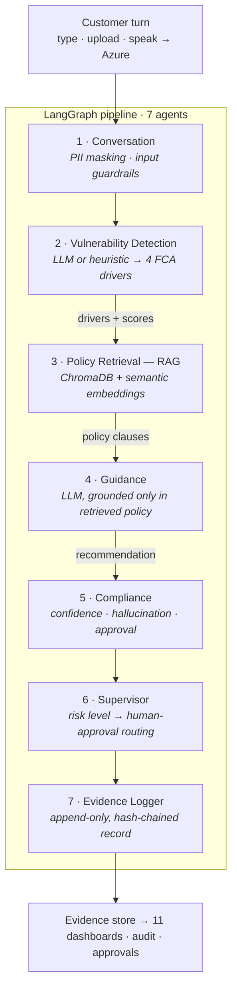

# GuardianCX — How it was built

> An advisory agent that detects vulnerable customers in regulated financial
> conversations, grounds its guidance in policy, keeps a human in the loop, and
> evidences that they were treated fairly.

## What it does

- **Detects vulnerability** across the four FCA drivers — health, life events,
  resilience, capability — on every customer turn. Signal-based, always advisory.
- **Grounds guidance in policy.** It retrieves the firm's prescribed adaptation
  from a knowledge base (RAG) and never invents policy.
- **Keeps a human in the loop.** High-risk recommendations are routed to an
  approval queue — the system recommends, a person decides.
- **Evidences fair treatment.** Every detection, recommendation, guardrail and
  decision is written to an append-only, hash-chained record.

## Architecture — a turn's journey

Only customer turns are assessed. A parallel **FastAPI** service exposes the same
pipeline for other channels. **Every stage degrades gracefully:** no LLM key →
keyword heuristic; no ChromaDB → in-memory store; no embeddings model → hashing;
no Postgres → SQLite. The app runs end-to-end with zero credentials, and each
integration activates when configured.

## Technology

| Layer | Technology | Fallback |
|-------|-----------|----------|
| Interface | **Streamlit** (11 pages) · Plotly charts | — |
| API | **FastAPI** | — |
| LLM | **Claude** (`claude-opus-4-8`) **or OpenRouter** · structured JSON | keyword heuristic |
| Orchestration | **LangGraph** `StateGraph` (7 agents) | sequential runner |
| Vector DB | **ChromaDB** (cosine) | in-memory store |
| Embeddings | **sentence-transformers** / **Azure OpenAI** | hashing embedder |
| Speech | **Azure Speech** (browser capture + REST) | text input |
| Database | **SQLAlchemy** — Postgres / SQLite | SQLite |
| Evidence | append-only, **hash-chained** log | — |
| Guardrails | PII · injection · toxicity · confidence · hallucination · human approval | custom validators (NeMo optional) |
| Observability | **Langfuse** · **MLflow / OpenTelemetry** | in-memory buffer |
| Config | **pydantic-settings** | `.env` / `st.secrets` |

## The 11 console pages

Executive Dashboard · Live Conversation Monitor · Vulnerability Detection ·
AI Guidance Panel · Human Approval Queue · Policy Knowledge Base (RAG search) ·
Guardrails · Audit Trail · Customer Timeline · Analytics & Evaluation · Settings.

## Guardrails

| Stage | Guardrail | Severity | Purpose |
|-------|-----------|----------|---------|
| Input | PII masking | warn | Redact emails, cards, sort codes, phones, IBANs |
| Input | Prompt injection | block | Detect instruction-override / prompt-extraction |
| Input | Toxicity | warn | Flag abusive language for tone-aware handling |
| Output | Confidence threshold | warn | Route low-confidence guidance to review |
| Output | Hallucination grounding | block | Reject citations not present in retrieved policy |
| Output | Human approval | block | Mandatory sign-off for high-risk recommendations |

## By the numbers

| | |
|---|---|
| LangGraph agents | **7** |
| Guardrails | **6** |
| Console pages | **11** |
| Policy clauses | **21** |
| FCA drivers | **4** |
| RAG hit-rate@3 | **100%** |
| Retrieval MRR | **0.96** |
| Tests passing | **12** |

Retrieval quality is **measured, not asserted**: a labelled test set
(query → expected policy clause) is scored on hit-rate / precision / recall / MRR
by the eval harness ([`scripts/eval_rag.py`](../scripts/eval_rag.py)) and the
Analytics page.

## How it was built

1. **Evidence-first MVP** — core: streaming detection → policy lookup → advisory
   guidance → an immutable, hash-chained evidence trail.
2. **GuardianCX — modular agentic rebuild** — a clean package
   (`agents · guardrails · rag · services · database · ui`) with a 7-agent
   LangGraph pipeline, ChromaDB RAG, the full guardrail stack, and an 11-page
   console + FastAPI.
3. **Live & multi-provider** — real-time chat with the agent, browser speech
   capture, and a pluggable LLM (Claude or OpenRouter), all with fallbacks.
4. **Deployment alignment** — single clean repo; configuration wired to Streamlit
   secrets so the same code runs locally and on Streamlit Cloud.
5. **Retrieval fix & evaluation** — diagnosed poor retrieval (a hashing
   fallback), switched to semantic embeddings, and added a RAG evaluation harness
   that proves quality — plus an analytics-grade Executive Dashboard.

---

*GuardianCX is an internal decision-support tool: advisory only — a human handler
makes every customer-facing decision. All data shown is synthetic.*
